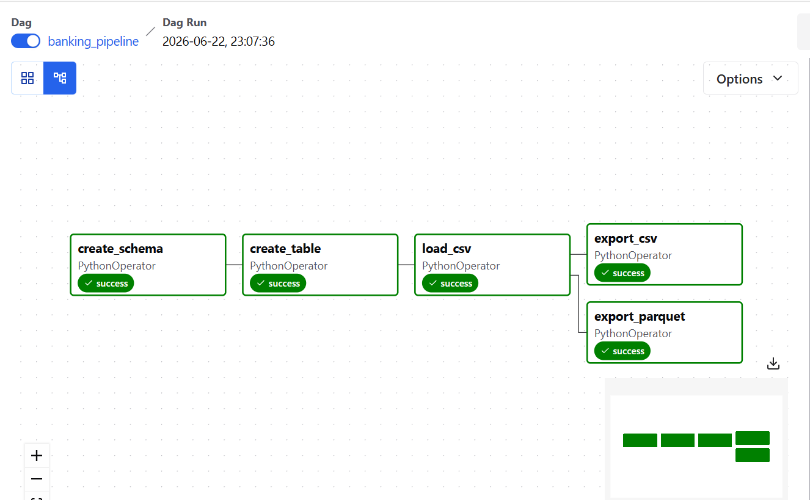
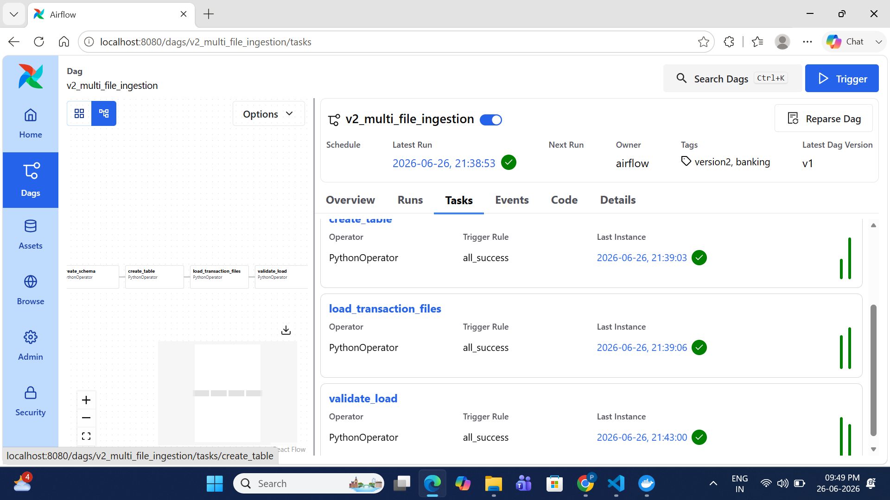
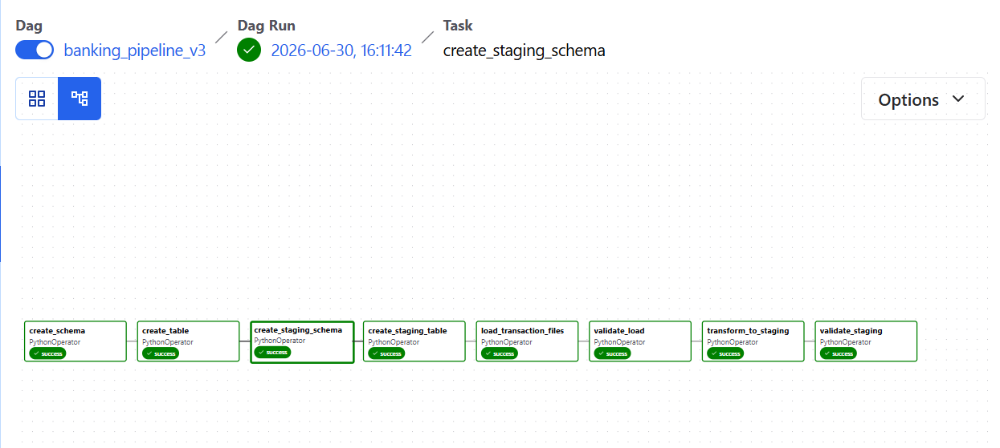

# Banking Data Engineering Platform - Version 3

## Overview

This project demonstrates an end-to-end data engineering pipeline using Apache Airflow and PostgreSQL.

The pipeline evolves across multiple versions:

- Version 1: Single-file ingestion and data export
- Version 2: Multi-format file ingestion (CSV, JSON, Parquet)
- Version 3: Data validation, transformation, and Raw → Staging ETL

## v1 Architecture

```text
PaySim Dataset (CSV)
        ↓
      Airflow
        ↓
   PostgreSQL
        ↓
 ┌───────────────┐
 │ transactions  │
 │    table      │
 └───────────────┘
        ↓
 ┌─────────┬──────────┐
 │   CSV   │ Parquet  │
 └─────────┴──────────┘
```

## v2 Architecture
```text
CSV
CSV
JSON
PARQUET
     ↓
Airflow
     ↓
Validation
     ↓
Standardization
     ↓
raw.transactions
```
## V3 Architecture

```text
CSV
JSON
PARQUET
CSV
      ↓
Airflow
      ↓
Schema Validation
      ↓
Data Quality Validation
      ↓
Data Type Standardization
      ↓
raw.transactions
      ↓
Business Transformations
      ↓
staging.transactions
      ↓
Validation
```

## Objectives

- Load banking transaction data into PostgreSQL
- Support CSV, JSON and Parquet ingestion
- Perform schema validation
- Perform data quality validation
- Standardize data types
- Transform raw data into a staging layer
- Orchestrate ETL using Apache Airflow
- Containerize the platform using Docker

## Tech Stack

* Python
* Apache Airflow
* PostgreSQL
* Pandas
* SQLAlchemy
* PyArrow
* Docker
* Docker Compose

## Dataset

Dataset Used: PaySim Mobile Money Transactions Dataset

Columns used:

| Source Column  | Target Column           |
| -------------- | ----------------------- |
| step           | step                    |
| type           | transaction_type        |
| amount         | amount                  |
| nameOrig       | source_account          |
| oldbalanceOrg  | source_old_balance      |
| newbalanceOrig | source_new_balance      |
| nameDest       | destination_account     |
| oldbalanceDest | destination_old_balance |
| newbalanceDest | destination_new_balance |
| isFraud        | is_fraud                |
| isFlaggedFraud | is_flagged_fraud        |

## Project Structure

```text
banking-data-engineering-pipeline/
│
airflow/
    dags/
        banking_pipeline.py
        banking_pipeline_v2.py
        banking_pipeline_v3.py

sql/
    create_schemas.sql
    create_transactions_table.sql
    create_staging_schema.sql
    create_staging_table.sql
    transform_to_staging.sql
│
├── data/
│   ├── input/
│   │   ├── transactions_jan.csv
│   │   ├── transactions_feb.parquet
│   │   ├── transactions_mar.json
│   │   └── transactions_apr.csv
│   │
│   ├── raw/
│   │   └── paysim.csv
│   │-- staging
│   │    |--transactions
│   └── exports/
│       ├── transactions.csv
│       └── transactions.parquet
│
├── docker-compose.yml
├── Dockerfile
├── requirements.txt
└── README.md
```

## Database Design

### Schema

```sql
raw
```

### Table

```sql
raw.transactions
```

Columns:

* step
* transaction_type
* amount
* source_account
* source_old_balance
* source_new_balance
* destination_account
* destination_old_balance
* destination_new_balance
* is_fraud
* is_flagged_fraud

## Airflow Workflow

### Task 1 - Create Schema

Creates the raw schema if it does not exist.

### Task 2 - Create Table

Creates the raw.transactions table.

### Task 3 - Create Staging Schema

Creates the staging.transactions schema.

### Task 4 - Create Staging Table

Creates the staging.transactions table.

### Task 5 - Load Multiple Files
Loads multiples files data into PostgreSQL.

### Task 6 - Validate Raw Load
validated the raw.transactions with raw.Analytics

### Task 6 - Transform Raw → Staging
transformed data loaded into staging table

### Task  - Validate Staging
```text
data/exports/transactions.csv
```

### Task 5 - Export Parquet

Exports PostgreSQL table data to:

```text
data/exports/transactions.parquet
```

## DAG Flow

```text
### Version 1

create_schema
      ↓
create_table
      ↓
load_csv
      ↓
 ┌─────────────┐
 │             │
 ↓             ↓
export_csv export_parquet


### Version 2

create_schema
      ↓
create_table
      ↓
load_transaction_files
      ↓
validate_load
```
version 3
create_schema
      ↓
create_table
      ↓
create_staging_schema
      ↓
create_staging_table
      ↓
load_transaction_files
      ↓
validate_load
      ↓
transform_to_staging
      ↓
validate_staging

## How to Run

### Start Services

```bash
docker compose up -d
```

### Verify Airflow

Open:

```text
http://localhost:8080
```

### Trigger DAG

Airflow UI

```text
banking_pipeline
    ↓
Trigger DAG
```

## Output

Generated files:

```text
data/exports/transactions.csv
data/exports/transactions.parquet
```

## Key Learnings

* PostgreSQL data loading
* Apache Airflow orchestration
* SQL execution from Airflow
* CSV export
* Parquet export
* Dockerized data engineering workflows
* Batch processing concepts

## Successful DAG Runs

### Version 1



### Version 2



### Version 3



## Project Versions

### Version 1
- Single CSV ingestion
- PostgreSQL loading
- CSV export
- Parquet export

### Version 2
- Multiple file ingestion
- Supports CSV, JSON and Parquet
- Dynamic file discovery
- Schema validation
- Data type standardization
- Loads all files into raw.transactions

Version 2 extends the pipeline to support ingestion from multiple file formats.

Supported formats:
- CSV
- JSON
- Parquet

The pipeline automatically:
- Discovers input files
- Validates the schema
- Standardizes column names
- Standardizes data types
- Loads all records into PostgreSQL

## Data Validation

The pipeline validates:

- Required columns
- Supported file formats
- Empty input directory
- Null values
- Duplicate records
- Transaction amount
- Transaction types
- Fraud flags

## Data Transformation

The pipeline transforms raw transaction data before loading it into the staging layer.

Transformations include:

- Column standardization
- Data type standardization
- Amount categorization
- Fraud status derivation

### Version 3

- Raw → Staging ETL
- Business transformations
- Schema validation
- Null validation
- Duplicate validation
- Amount validation
- Transaction type validation
- Fraud flag validation
- Data type standardization
- Logging using Python logging module
- Staging data validation
```
### The pipeline validates:

- Required columns
- Supported file formats
- Empty input directory
- Null values
- Duplicate records
- Transaction amount
- Transaction types
- Fraud flags

### Version 4+

### Version 4

- Incremental loading
- Metadata-driven ETL
- Exception handling
- Error logging
- Audit tables
- Reject records handling


## Successful DAG Run

